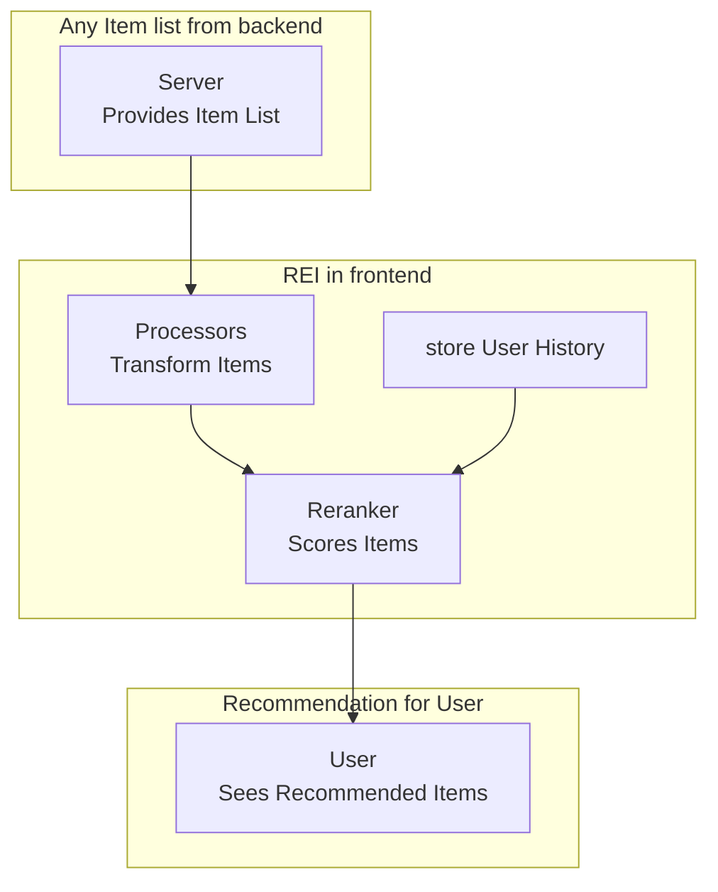
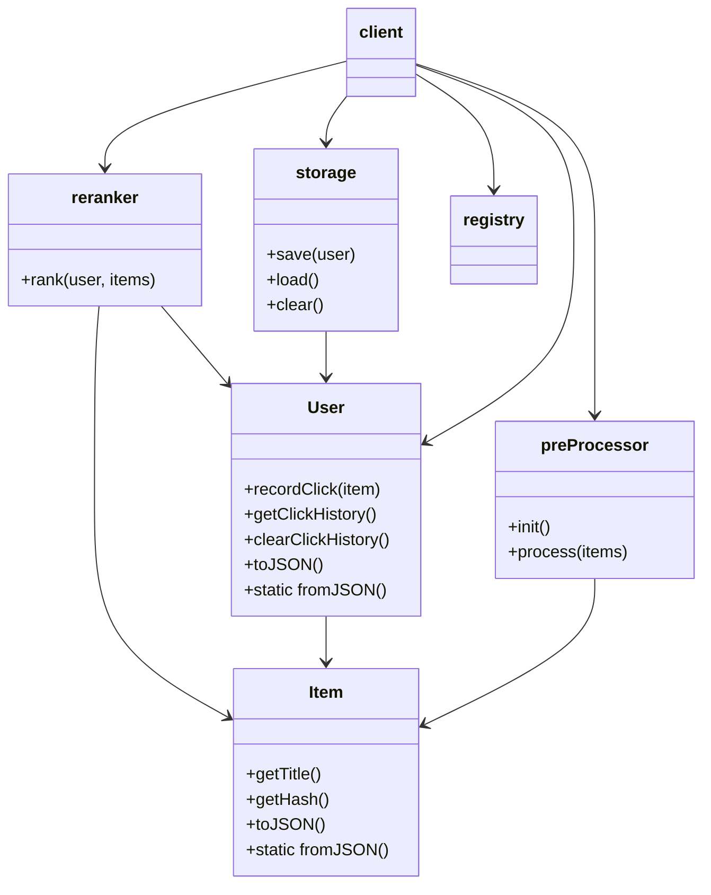
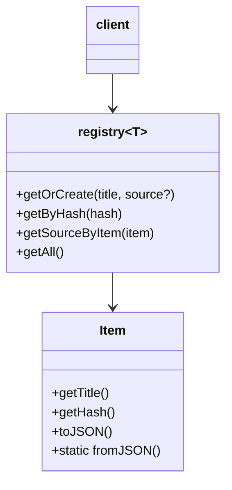
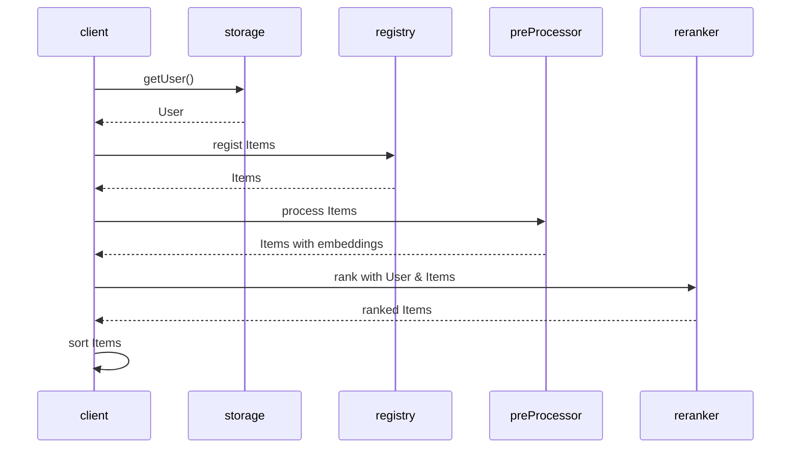
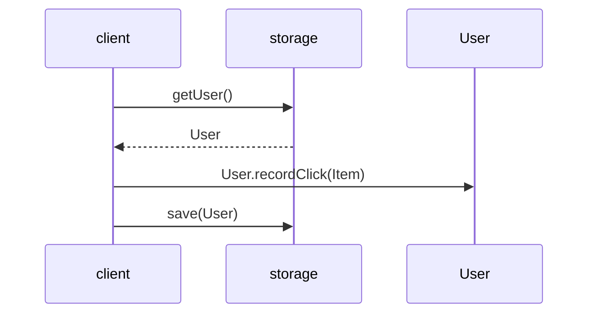
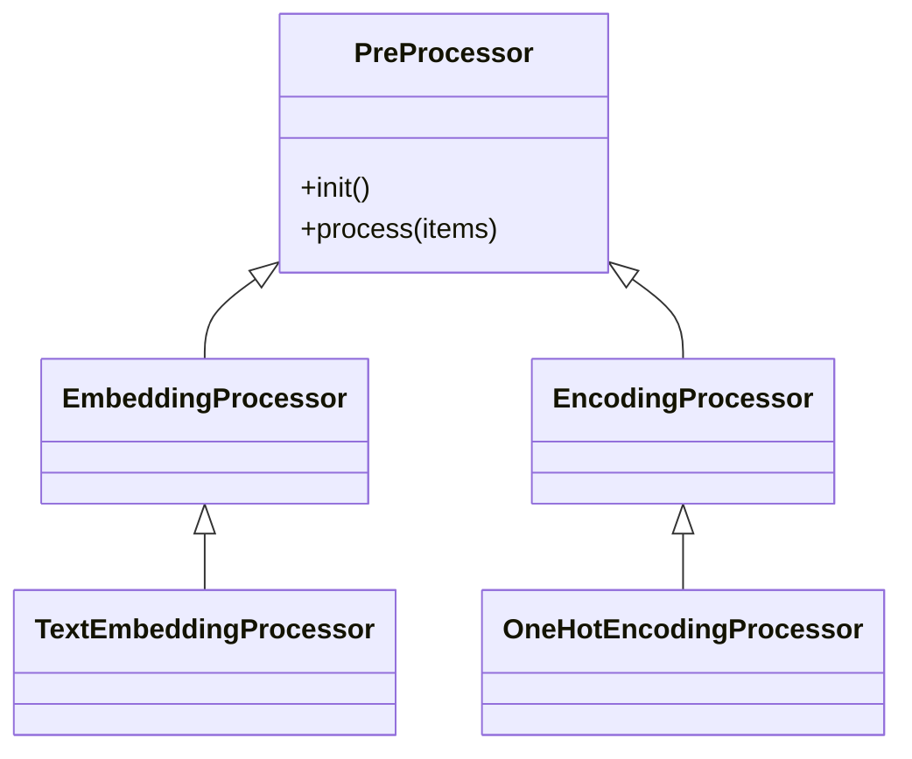
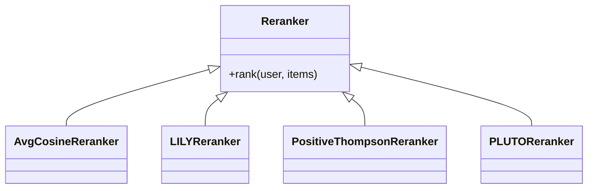

# REI (Recommendation Everything Independent)



REI is a lightweight, frontend‑only recommendation toolkit. It runs completely in the browser, embedding data with small pretrained models, simple tag rules, or other lightweight methods, and re‑ranking items locally.

## Core Idea

### Overview

REI is built on a simple principle: **everything happens on the frontend**.

This means no backend logic, no API calls, and no tracking—just client‑side computation. This makes REI private by default, lightweight, and easy to integrate.

### Key Features

* Lightweight: Designed for edge devices and resource-limited environments.
* Privacy by design: User data never leaves the device.
* Low disruption: REI reorders existing items instead of changing what users see, keeping experiences familiar, while working directly with the limited set of content already available in the DOM.

### Ideal Use Cases

* News readers / RSS feeds – recent items matter most
* Trending or hot lists – popularity-driven content
* E-commerce carousels – limited visible products

### When to Use

REI is best suited for environments where:

* Backend or data resources are limited
* Privacy or compliance is a concern
* Existing sorting (recency, popularity) already works, but subtle personalization is desired
* Minimal engineering effort and stable UX are priorities

## Minimum Viable Product Demo

There's an MVP of REI that helps you quickly understand how REI works and what it does.

This MVP demonstrates:

* A list of items and a click history panel.
* Clicking an item updates the user profile and instantly reranks items.
* Multi-language embedding via `Xenova/paraphrase-multilingual-MiniLM-L12-v2` (running fully in-browser via `transformers.js`).
* Ranking uses cosine similarity on the user's average embedding.


You can find the working MVP in the root folder: [`mvp.html`](https://github.com/avengerandy/REI/blob/master/mvp.html).

> The demo dataset is sourced from the book rankings on 博客來 ([https://www.books.com.tw](https://www.books.com.tw)) and is used solely for research and testing purposes. No commercial use is intended. If any infringement is found, please contact us for immediate removal.

## Architecture

The REI core modules provide the essential components to achieve the system’s goals. Users can integrate these components into their own workflows according to their needs.

* statistics: utility functions for computing statistical distributions and probability density functions.
* entities: `Item` and `User` store data, embeddings, and click history.
* preProcessor: pre-processor `Item`.
* reranker: implements ranking strategies.
* storage: Local and session storage for user profiles.
* registry (optional): `ItemRegistry` manages items and associated DOM elements.

### Class Diagram

#### core



#### registry (optional)



### Sequence Diagram

#### init (sort)



#### event (on click)



## Processors

Processors transform raw item data into representations used by rerankers. For example, REI embeds item text using `Xenova/paraphrase-multilingual-MiniLM-L12-v2`.

The following diagram shows the processor hierarchy and extension points:



Processors are pluggable and can be replaced to support other data or representations by implementing `PreProcessor`, such as rule-based tags, lightweight features, or image / multimodal embeddings (e.g. CLIP). When using larger models, frontend performance should be considered.

## Rerankers

REI provides two reranking paradigms based on item representation:

* Embedding-based
* Tag-based

For each paradigm, REI includes:

* one commonly used baseline algorithm
* one alternative algorithm designed specifically for frontend usage

### Embedding-based

#### Average Cosine Similarity

* User profile: average embedding of clicked items.
* Item score: cosine similarity to the user profile.

A common and widely used baseline. However, it has known limitations:

* Limited exploration when the click history is small.
* Tendency to collapse into a single dominant direction after convergence.

#### LILY (Likelihood-based Incremental Learning)

LILY is a contextual bandit algorithm designed for vectorized contexts under binary feedback. It is designed specifically for frontend usage.

Compared to cosine similarity:

* Improves exploration when click history is small.
* Avoids a single dominant direction after convergence.

Full algorithm details: [https://github.com/avengerandy/LILY](https://github.com/avengerandy/LILY)

### Tag-based

#### Positive Thompson Sampling

A positive-feedback-only variant of Thompson Sampling, commonly used for categorical personalization.

A known limitation of Thompson Sampling is that it tends to converge to a single dominant tag after convergence.

#### PLUTO

PLUTO (Probabilistic Learning Using Tag-based Ordering) is a tag-driven reranking algorithm designed for lightweight, client-side personalization.

Compared to Thompson Sampling, it prevents convergence to a single dominant tag.

Full algorithm details: [https://github.com/avengerandy/PLUTO](https://github.com/avengerandy/PLUTO)

### Custom

If none of the provided strategies fit your use case, REI allows custom rerankers by implementing `Reranker`.

The following diagram shows the reranker hierarchy and extension points:



At the next section, we provide four real-world examples, each demonstrating one of the reranking strategies above on an actual website.

## Browser Extension Examples

We provide examples showing REI applied to existing websites:

* Automatically extract visible items from pages (books, products, etc.).
* Compute embeddings and rerank items locally.
* Demonstrates the concept of personalized browsing without data collection.

TODO: List example websites, including screenshots and which Processors & Rerankers they use.

## Testing & Coding style & Build

REI’s core modules have comprehensive test coverage, divided into three levels based on dependency scope. Each module is tested according to its characteristics and responsibilities, so not every module undergoes all three levels of testing.

```bash
# run all of them with coverage report
npm run test:all

> test:all
> vitest run tests --coverage


 RUN  v3.2.4 /app
      Coverage enabled with istanbul

 ✓ tests/unit/core/statistics.test.ts (10 tests) 31ms
 ✓ tests/functional/core/registry.test.ts (7 tests) 4ms
 ✓ tests/unit/core/entities.test.ts (7 tests) 4ms
 ✓ tests/functional/core/reranker.test.ts (16 tests) 32ms
 ✓ tests/functional/core/preProcessor.test.ts (6 tests) 5ms
 ✓ tests/integration/core/preProcessor.test.ts (4 tests) 4792ms
   ✓ TextEmbeddingProcessor > should work whether allowLocalModels true or false  2501ms
   ✓ TextEmbeddingProcessor > should embed item titles into embeddings with its dimension  1081ms
   ✓ TextEmbeddingProcessor > should produce embeddings with values between 0 and 1  1206ms
 ✓ tests/functional/core/storage.test.ts (12 tests) 6ms

 Test Files  7 passed (7)
      Tests  62 passed (62)
   Start at  07:26:35
   Duration  26.57s (transform 4.97s, setup 0ms, collect 10.37s, tests 4.87s, environment 25.05s, prepare 4.71s)

 % Coverage report from istanbul
-----------------|---------|----------|---------|---------|-------------------
File             | % Stmts | % Branch | % Funcs | % Lines | Uncovered Line #s
-----------------|---------|----------|---------|---------|-------------------
All files        |   98.83 |    94.59 |     100 |   99.68 |
 entities.ts     |     100 |      100 |     100 |     100 |
 preProcessor.ts |     100 |      100 |     100 |     100 |
 registry.ts     |     100 |      100 |     100 |     100 |
 reranker.ts     |    98.1 |    92.98 |     100 |   99.27 | 247
 statistics.ts   |   97.43 |       90 |     100 |     100 | 82
 storage.ts      |     100 |      100 |     100 |     100 |
-----------------|---------|----------|---------|---------|-------------------
```

### 1. Unit

* Must not depend on other REI modules.
* No access to any **external resources** (network, file system, etc.).
* Typically used for lowest-level objects or helper functions.

```bash
npm run test:unit
```

### 2. Functional

* Can depend on lower-level REI modules (assumed to be correct).
* Tests logical behavior across multiple components.
* Still **no external resources** — mock them if necessary (ex: jsdom).

```bash
npm run test:functional
```

### 3. Integration

* May access **external resources** (e.g., network, local files, APIs).
* Tests full workflows or real pipelines.
* Be cautious of side effects, as these tests execute real operations.

```bash
npm run test:integration
```

### Coding Style

REI follows Google TypeScript Style (GTS) for linting and formatting.

* `lint` checks for style violations.
* `fix` automatically corrects common issues.

```bash
npm run lint
npm run fix
```

### Build

REI uses esbuild for bundling and type-checking via TypeScript.

* `typecheck` ensures type safety without emitting files.
* `build` compiles all targets (index, books, content) into `public/dist/`.

```bash
npm run typecheck
npm run build
```

## License

This project is licensed under the MIT License. See the [LICENSE](https://github.com/avengerandy/REI/blob/master/LICENSE) file for details.
