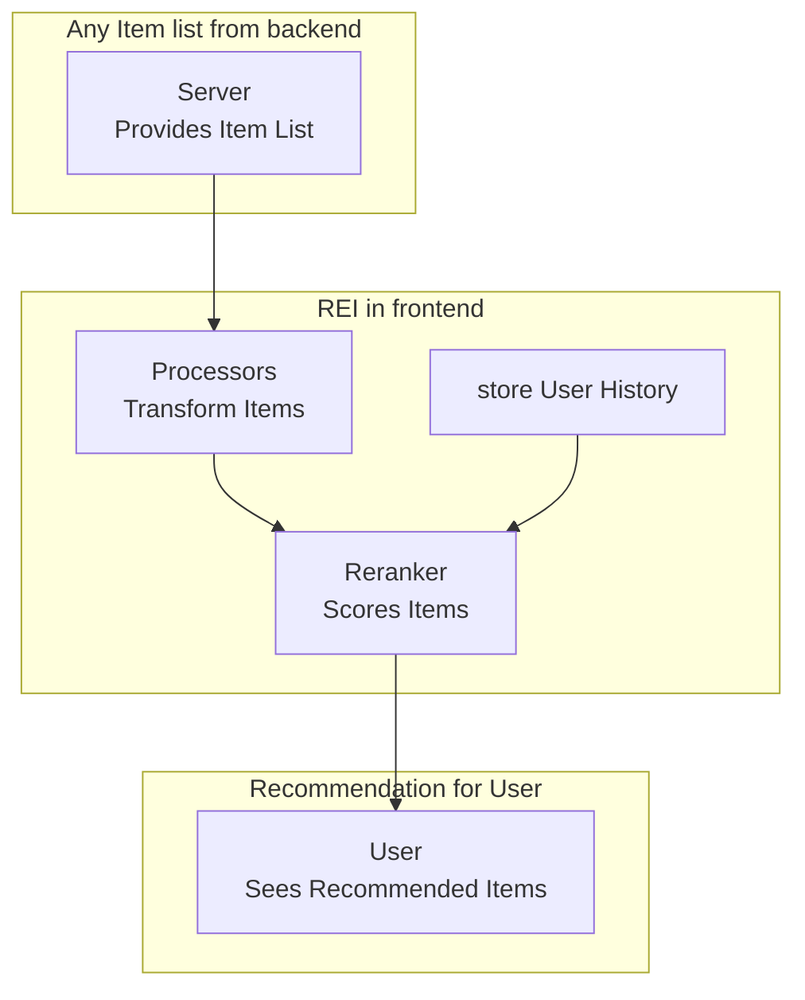
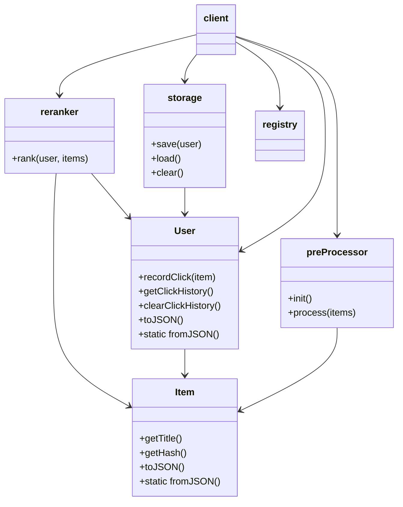
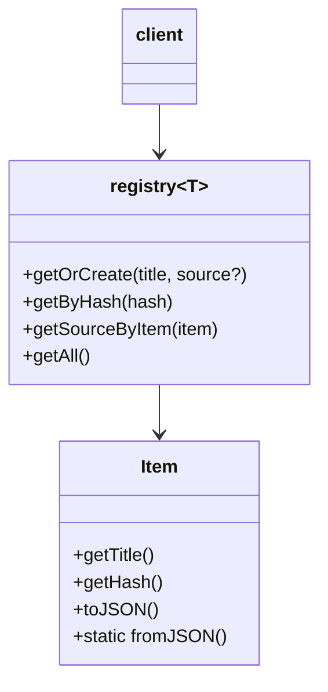
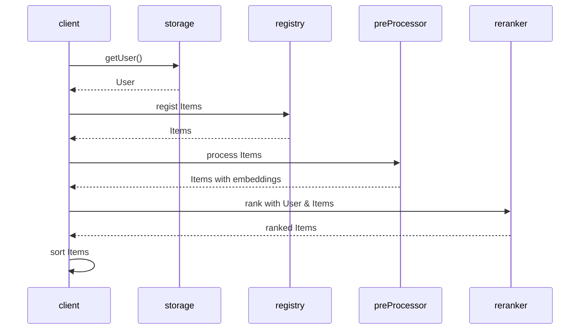
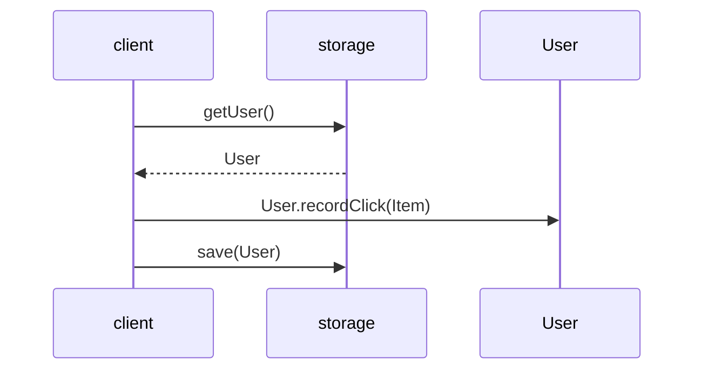
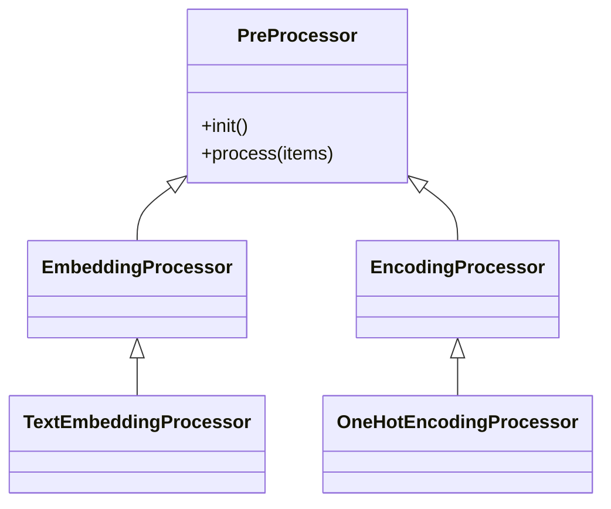
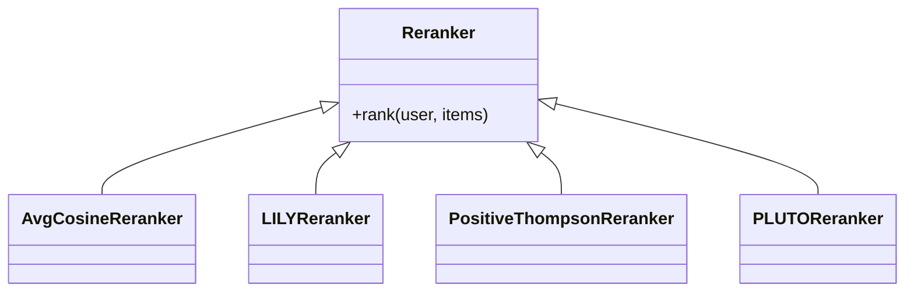

# REI (Recommendation Everything Independent)



REI is a lightweight, frontend‑only recommendation toolkit. It runs completely in the browser, embedding data with small pretrained models, simple tag rules, or other lightweight methods, and re‑ranking items locally.

## Core Idea

### Overview

REI is built on a simple principle: **everything happens on the frontend**.

This means no backend logic, no API calls, and no tracking—just client‑side computation. This makes REI private by default, lightweight, and easy to integrate.

### Key Features

* Lightweight: Designed for edge devices and resource-limited environments.
* Privacy by design: User data never leaves the device.
* Low disruption: REI reorders existing items instead of changing what users see, keeping experiences familiar, while working directly with the limited set of content already available in the DOM.

### Ideal Use Cases

* News readers / RSS feeds – recent items matter most
* Trending or hot lists – popularity-driven content
* E-commerce carousels – limited visible products

### When to Use

REI is best suited for environments where:

* Backend or data resources are limited
* Privacy or compliance is a concern
* Existing sorting (recency, popularity) already works, but subtle personalization is desired
* Minimal engineering effort and stable UX are priorities

## Minimum Viable Product Demo

There's an MVP of REI that helps you quickly understand how REI works and what it does.

This MVP demonstrates:

* A list of items and a click history panel.
* Clicking an item updates the user profile and instantly reranks items.
* Multi-language embedding via `Xenova/paraphrase-multilingual-MiniLM-L12-v2` (running fully in-browser via `transformers.js`).
* Ranking uses cosine similarity on the user's average embedding.


You can find the working MVP in the root folder: [`mvp.html`](https://github.com/avengerandy/REI/blob/master/mvp.html).

> The demo dataset is sourced from the book rankings on 博客來 ([https://www.books.com.tw](https://www.books.com.tw)) and is used solely for research and testing purposes. No commercial use is intended. If any infringement is found, please contact us for immediate removal.

## Architecture

The REI core modules provide the essential components to achieve the system’s goals. Users can integrate these components into their own workflows according to their needs.

* statistics: utility functions for computing statistical distributions and probability density functions.
* entities: `Item` and `User` store data, embeddings, and click history.
* preProcessor: pre-processor `Item`.
* reranker: implements ranking strategies.
* storage: Local and session storage for user profiles.
* registry (optional): `ItemRegistry` manages items and associated DOM elements.

### Class Diagram

#### core



#### registry (optional)



### Sequence Diagram

#### init (sort)



#### event (on click)



## Processors

Processors transform raw item data into representations used by rerankers. For example, REI embeds item text using `Xenova/paraphrase-multilingual-MiniLM-L12-v2`.

The following diagram shows the processor hierarchy and extension points:



Processors are pluggable and can be replaced to support other data or representations by implementing `PreProcessor`, such as rule-based tags, lightweight features, or image / multimodal embeddings (e.g. CLIP). When using larger models, frontend performance should be considered.

## Rerankers

REI provides two reranking paradigms based on item representation:

* Embedding-based
* Tag-based

For each paradigm, REI includes:

* one commonly used baseline algorithm
* one alternative algorithm designed specifically for frontend usage

### Embedding-based

#### Average Cosine Similarity

* User profile: average embedding of clicked items.
* Item score: cosine similarity to the user profile.

A common and widely used baseline. However, it has known limitations:

* Limited exploration when the click history is small.
* Tendency to collapse into a single dominant direction after convergence.

#### LILY (Likelihood-based Incremental Learning)

LILY is a contextual bandit algorithm designed for vectorized contexts under binary feedback. It is designed specifically for frontend usage.

Compared to cosine similarity:

* Improves exploration when click history is small.
* Avoids a single dominant direction after convergence.

Full algorithm details: [https://github.com/avengerandy/LILY](https://github.com/avengerandy/LILY)

### Tag-based

#### Positive Thompson Sampling

A positive-feedback-only variant of Thompson Sampling, commonly used for categorical personalization.

A known limitation of Thompson Sampling is that it tends to converge to a single dominant tag after convergence.

#### PLUTO

PLUTO (Probabilistic Learning Using Tag-based Ordering) is a tag-driven reranking algorithm designed for lightweight, client-side personalization.

Compared to Thompson Sampling, it prevents convergence to a single dominant tag.

Full algorithm details: [https://github.com/avengerandy/PLUTO](https://github.com/avengerandy/PLUTO)

### Custom

If none of the provided strategies fit your use case, REI allows custom rerankers by implementing `Reranker`.

The following diagram shows the reranker hierarchy and extension points:



At the next section, we provide four real-world examples, each demonstrating one of the reranking strategies above on an actual website.

## Browser Extension Examples

Below are four real-world examples showing how REI can be applied to existing websites. Each example includes a brief scenario, user data handling, preprocessing, reranker choice, and a screenshot of the result. UI controller details are omitted for clarity; full inject code can be found in the repository.

### Tenlong Example


* **Scenario**: When researching a specific field, users visit Tenlong to browse books related to that field.
* **Requirement**: Re-rank the latest books in each language according to recent research topics, highlighting new releases relevant to the field.
* **User**: Uses the page’s click history directly; no additional tracking required.
* **Preprocessing**: Book titles are used as content, embedded with text embeddings.
* **Reranker**: Cosine similarity. Single-peak preference is sufficient because research topics are usually specific.

```ts
const user = new User();
const registry = new ItemRegistry<HTMLElement>();
const ui = new TenlongUIController(registry);
const processor = new TextEmbeddingProcessor();
processor.setAllowLocalModels(true);
const reranker = new AvgCosineReranker(processor.getModelEmbeddingDim());

await processor.init();

// process user history
let userHistoryItems = ui.getUserHistory();
userHistoryItems = await processor.process(userHistoryItems);
userHistoryItems.forEach(item => user.recordClick(item));

// process & sort items per language
const zhTwItems = await processor.process(ui.getZhTwItems());
ui.sortZhTwItems(await reranker.rank(user, zhTwItems));

const enItems = await processor.process(ui.getEnItems());
ui.sortEnItems(await reranker.rank(user, enItems));

const zhCnItems = await processor.process(ui.getZhCnItems());
ui.sortZhCnItems(await reranker.rank(user, zhCnItems));
```

Full inject code: [`inject/tenlong.ts`](https://github.com/avengerandy/REI/blob/master/src/inject/tenlong.ts)

> The Tenlong dataset and website are the property of their respective owners ([https://www.tenlong.com.tw](https://www.tenlong.com.tw)). This example is provided solely for research and testing purposes. REI does not modify or disrupt any website operations. If any infringement is found, please contact us for immediate removal.

### Books Example


* **Scenario**: Popular books leaderboard with mostly fixed types.
* **Requirement**: Adjust ranking based on previously clicked book types to emphasize preferred genres.
* **User**: Click history is recorded locally, starting from zero.
* **Preprocessing**: Book titles embedded using text embeddings.
* **Reranker**: LILY. Multi-peak convergence is desired because user may like multiple genres; exploration is needed for cold-start.

```ts
const store = UserStoreFactory.create(UserStorageType.Local);
const user = (await store.load()) ?? new User();
user.setMaxHistorySize(20);

const processor = new TextEmbeddingProcessor();
processor.setSigmoidOutput(true);
processor.setAllowLocalModels(true);
await processor.init();

const reranker = new LILYReranker(processor.getModelEmbeddingDim());
const registry = new ItemRegistry<HTMLElement>();
const ui = new BooksUIController(registry);

// processor Recall items
let items = ui.extractItems();
items = await processor.process(items);
const reranked = await reranker.rank(user, items);

ui.sort(reranked);
ui.onItemClick(async clickedItem => {
  user.recordClick(clickedItem);
  await store.save(user);
});
```

Full inject code: [`inject/books.ts`](https://github.com/avengerandy/REI/blob/master/src/inject/books.ts)

> The Books dataset and website are the property of their respective owners ([https://www.books.com.tw](https://www.books.com.tw)). This example is provided solely for research and testing purposes. REI does not modify or disrupt any website operations. If any infringement is found, please contact us for immediate removal.

### Pixiv Example


* **Scenario**: Tag-based website; users search for tags to find relevant artworks.
* **Requirement**: Recommend tags based on frequently searched tags to facilitate future exploration.
* **User**: Click/search history recorded locally across pages.
* **Preprocessing**: None (already tag-based).
* **Reranker**: Positive Thompson Sampling. Each clicked tag receives positive reward; final ranking based on Beta sampling. No need to worry about convergence; frequent tags naturally dominate.

```ts
const store = UserStoreFactory.create(UserStorageType.Local);
const user = (await store.load()) ?? new User();
user.setMaxHistorySize(100);

const pathname = window.location.pathname;
const tagRegex = /\/tags\/(.*)\/(artworks|illustrations)/;
if (tagRegex.test(pathname)) {
  const result = tagRegex.exec(pathname);
  if (Array.isArray(result)) {
    const item = new Item(self.crypto.randomUUID());
    item.setType(decodeURI(result[1]));
    user.recordClick(item);
    await store.save(user);
  }
  return;
}

const tags = new Set<string>();
const items = [];
for (const item of user.getClickHistory()) {
  const tag = String(item.getType());
  if (!tags.has(tag)) {
    tags.add(tag);
    items.push(item);
  }
}

const reranker = new PositiveThompsonReranker();
const reranked = await reranker.rank(user, items);

// update UI
```

Full inject code: [`inject/pixiv.ts`](https://github.com/avengerandy/REI/blob/master/src/inject/pixiv.ts)

> The Pixiv dataset and website are the property of their respective owners ([https://www.pixiv.net](https://www.pixiv.net)). This example is provided solely for research and testing purposes. REI does not modify or disrupt any website operations. If any infringement is found, please contact us for immediate removal.

### DLsite Example


* **Scenario**: DLsite homepage's latest items are sorted by popularity or release date.
* **Requirement**: Re-rank latest items according to user’s click history, aligning type (tag) distribution with user preferences.
* **User**: History is recorded locally, as frontend cannot access it.
* **Preprocessing**: None (already tag-based).
* **Reranker**: PLUTO. Handles multiple items per type; prevents single-tag domination as would occur with simple Thompson Sampling.

```ts
const store = UserStoreFactory.create(UserStorageType.Local);
const user = (await store.load()) ?? new User();
user.setMaxHistorySize(20);

const reranker = new PLUTOReranker({T: 10});
const registry = new ItemRegistry<HTMLElement>();
const ui = new DlsiteUIController(registry);

// processor Recall items
ui.showAllNewItems();
const items = ui.extractItems();
const reranked = await reranker.rank(user, items);

ui.sort(reranked);
ui.onItemClick(async clickedItem => {
  user.recordClick(clickedItem);
  await store.save(user);
});
```

Full inject code: [`inject/dlsite.ts`](https://github.com/avengerandy/REI/blob/master/src/inject/dlsite.ts)

> The DLsite dataset and website are the property of their respective owners ([https://www.dlsite.com](https://www.dlsite.com)). This example is provided solely for research and testing purposes. REI does not modify or disrupt any website operations. If any infringement is found, please contact us for immediate removal.

## Testing & Coding style & Build

REI’s core modules have comprehensive test coverage, divided into three levels based on dependency scope. Each module is tested according to its characteristics and responsibilities, so not every module undergoes all three levels of testing.

```bash
# run all of them with coverage report
npm run test:all

> test:all
> vitest run tests --coverage


 RUN  v3.2.4 /app
      Coverage enabled with istanbul

 ✓ tests/unit/core/statistics.test.ts (10 tests) 37ms
 ✓ tests/unit/core/entities.test.ts (7 tests) 4ms
 ✓ tests/functional/core/registry.test.ts (7 tests) 3ms
 ✓ tests/functional/core/reranker.test.ts (16 tests) 41ms
 ✓ tests/functional/core/preProcessor.test.ts (7 tests) 9ms
 ✓ tests/integration/core/preProcessor.test.ts (4 tests) 4751ms
   ✓ TextEmbeddingProcessor > should work whether allowLocalModels true or false  2555ms
   ✓ TextEmbeddingProcessor > should embed item titles into embeddings with its dimension  1122ms
   ✓ TextEmbeddingProcessor > should produce embeddings with values between 0 and 1  1071ms
 ✓ tests/functional/core/storage.test.ts (12 tests) 6ms

 Test Files  7 passed (7)
      Tests  63 passed (63)
   Start at  15:37:01
   Duration  26.83s (transform 2.94s, setup 0ms, collect 10.20s, tests 4.85s, environment 25.37s, prepare 4.32s)

 % Coverage report from istanbul
-----------------|---------|----------|---------|---------|-------------------
File             | % Stmts | % Branch | % Funcs | % Lines | Uncovered Line #s
-----------------|---------|----------|---------|---------|-------------------
All files        |   98.85 |     95.2 |     100 |   99.69 |
 entities.ts     |     100 |      100 |     100 |     100 |
 preProcessor.ts |     100 |      100 |     100 |     100 |
 registry.ts     |     100 |      100 |     100 |     100 |
 reranker.ts     |    98.1 |    92.98 |     100 |   99.27 | 247
 statistics.ts   |   97.43 |       90 |     100 |     100 | 82
 storage.ts      |     100 |      100 |     100 |     100 |
-----------------|---------|----------|---------|---------|-------------------
```

### 1. Unit

* Must not depend on other REI modules.
* No access to any **external resources** (network, file system, etc.).
* Typically used for lowest-level objects or helper functions.

```bash
npm run test:unit
```

### 2. Functional

* Can depend on lower-level REI modules (assumed to be correct).
* Tests logical behavior across multiple components.
* Still **no external resources** — mock them if necessary (ex: jsdom).

```bash
npm run test:functional
```

### 3. Integration

* May access **external resources** (e.g., network, local files, APIs).
* Tests full workflows or real pipelines.
* Be cautious of side effects, as these tests execute real operations.

```bash
npm run test:integration
```

### Coding Style

REI follows Google TypeScript Style (GTS) for linting and formatting.

* `lint` checks for style violations.
* `fix` automatically corrects common issues.

```bash
npm run lint
npm run fix
```

### Build

REI uses esbuild for bundling and type-checking via TypeScript.

* `typecheck` ensures type safety without emitting files.
* `build` compiles all targets (index, books, content) into `public/dist/`.

```bash
npm run typecheck
npm run build
```

## License

This project is licensed under the MIT License. See the [LICENSE](https://github.com/avengerandy/REI/blob/master/LICENSE) file for details.
